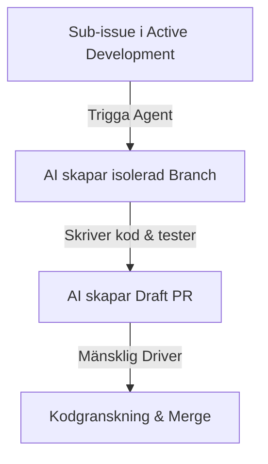
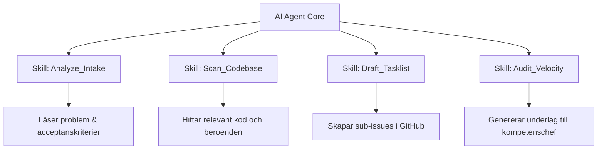

## AI-integration

Modellen är väl förberedd för att integrera AI-agenter i utvecklingsflödet. Strukturen med `Epic Drivers` och `Tasklists` gör att agenter kan verka autonomt utan att skapa kodkaos.

### A. AI:n som Co-Driver under Refinement

Innan ett Refinement-möte startar kan den mänskliga Drivern trigga en **Discovery Agent** att analysera moder-Epicen.

* **Aktivitet:** Agenten läser av intagsmallens tre frågor i `🔵 Refinement Queue`, analyserar befintlig kodbas och genererar ett första utkast till en teknisk **GitHub Tasklist**.
* **Resultat:** Den mänskliga Drivern slipper starta från ett tomt blad och använder Refinement-mötet till att validera, justera och godkänna agentens förslag tillsammans med teamet.

### B. AI:n som Execution Agent (Kodningsfasen)

När en Epic flyttas till `🟢 Active Development` och sub-issues har skapats, kan en **Coding Agent** tilldelas en specifik sub-issue.

* **Operationell regel för AI-utveckling:** En AI-agent får **aldrig** tilldelas rollen som övergripande `Epic Driver`. AI-agenten tilldelas endast enskilda, välavgränsade sub-issues. Den mänskliga Drivern behåller alltid det arkitektoniska ansvaret och godkänner agentens Pull Requests (PR).

### C. Automatiserad Styrning (Guardrails)

För att förhindra att AI-agenter skapar "scope creep" eller överbelastar systemet ställs följande GitHub-regler in:

1. **WIP-limits för AI:** En specifik AI-agent (eller tjänstekonto) har en hård spärr på max två aktiva sub-issues i `🟢 Active Development` samtidigt.
2. **Automatiska tester:** Ingen kod skriven av en AI-agent tillåts lämna Draft-status i sin PR förrän den har passerat 100% av repositoryts CI/CD-tester (Continuous Integration).

### D. Agentic Skills (Teknisk arkitektur för agenter)

För att operationalisera detta i arbetssätt som LangGraph, AutoGen eller Semantic Kernel, utrustas AI-agenterna med specifika, kodbaserade **Skills** (Tools).

Strukturen för dessa skills ser ut enligt följande:

1. `Analyze_Intake_Skill`: Extraherar nyckelord, identifierar funktionella krav från intagsmallen på en ny Epic i `🔵 Refinement Queue`.
2. `Scan_Codebase_Skill`: Söker igenom det aktuella GitHub-repositoryt efter relevanta filer, API-ändpunkter och arkitektoniska mönster.
3. `Draft_Tasklist_Skill`: Använder GitHubs API för att generera ett färdigt förslag på en Markdown Tasklist inuti moder-Epicen.
4. `Audit_Velocity_Skill`: Aggregerar data från `Impact`-vyn för att paketera en objektiv PDF-rapport till kompetenschefen inför lönesamtalet.
