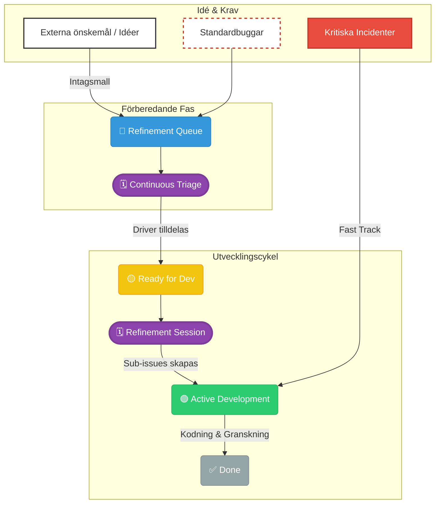
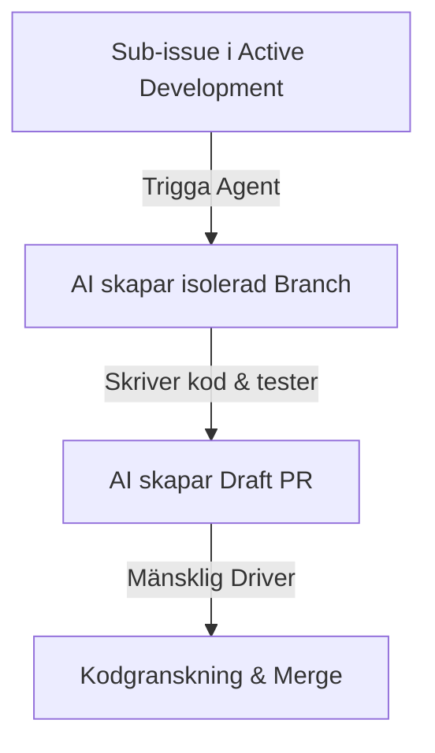
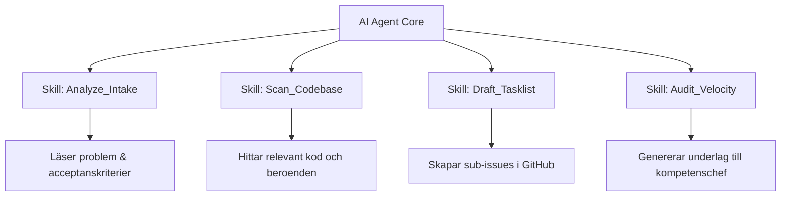
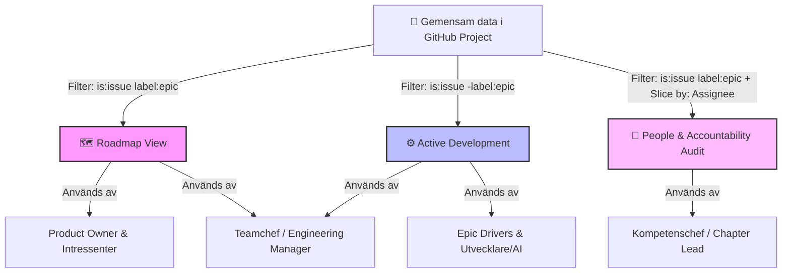

# Den Agila Buffern - en modell för att synkronisera Kanban med kvartalsplanering

| | |
| :--- | :--- |
| **Författare:** | Stefan Backelin |
| **Version:** | 1.1 |
| **Senast uppdaterad:** | 2026-06-29 |

## Innehållsförteckning

1. [Introduktion](#introduktion)
2. [Grundprincip: Horisonter istället för fasta datum](#grundprincip)
3. [Teoretisk bakgrund](#teoretisk-bakgrund)
4. [Processflöde & den dynamiska cykeln](#processflode)
5. [Intag, refinement och nedbrytning av epics](#intag)
6. [Kadens & ceremonier](#kadens)
7. [Rollfördelning och ansvarsmatris (RACI)](#rollfördelning-och-ansvarsmatris-raci)
8. [Förväntansstyrning](#forvantansstyrning)
9. [Styrningsprinciper och operationella begränsningar](#styrningsprinciper)
10. [Kärnfördelar](#karnfordelar)
11. [AI-Integration](#ai-integration)
12. [DORA-metriker](#dora-metriker)
13. [Steg-för-steg-guide för GitHub-implementation](#github-guide)
14. [Ordlista & Begreppsförklaringar](#ordlista)

---

## <a id="introduktion"></a> Introduktion

Detta arbetssätt är byggt för att lösa den klassiska dragkampen i matrisorganisationer: krocken mellan affärssidans behov av **långsiktig förutsägbarhet** och utvecklarnas behov av **fokuserad utvecklingstid**.

### Friktionen

* **Affärssidan (Stakeholders):** Behöver veta ungefär när funktioner levereras för att t. ex. kunna planera marknadsföring. Detta leder ofta till krav på rigida kvartalsplaner och låsta releasedatum.
* **Utvecklingsteamet:** Verkar i en komplex, föränderlig teknisk miljö där fasta datum sällan håller. Resultatet blir ofta estimeringshets, teknisk skuld och möteströtthet.

Detta dokument beskriver ett arbetssätt som tillåter även en icke-teknisk chef att styra leveransen, ger kompetenschefer full insyn i medarbetarnas prestationer, och skyddar utvecklarnas kalendrar från mikrostyrning.

---

## <a id="grundprincip"></a> Grundprincip: Horisonter istället för fasta datum

Istället för att fästa leveranser vid specifika veckor eller datum, använder detta arbetssätt **tids-horisonter** (`Now`, `Next`, `Later`). Detta flyttar fokus från "När är det exakt klart?" till "Vad är vår nuvarande prioritet?".

* **Now (Nu):** Det teamet har committat till och arbetar på just nu. Fullt fokus, inga störningsmoment.
* **Next (Nästa):** Den rörliga bufferten. Godkända, förberedda och tekniskt nedbrutna initiativ som står på tur.
* **Later (Senare):** Grova idéer och framtida önskemål som ännu inte har validerats eller tilldelats resurser.

Genom att hålla `Next`-kolumnen flytande kan organisationen byta riktning mellan kvartalen utan att kasta bort påbörjat arbete.

---

## <a id="teoretisk-bakgrund"></a> Teoretisk bakgrund

Detta arbetssätt är inte ett påhittat kompromissverktyg, utan vilar på etablerad köteori, agil forskning och modern produktmetodik:

* **Campbells lag:** *"Ju mer ett kvantitativt socialt mått används för socialt beslutsfattande, desto mer utsatt kommer det att vara för förvrängning och desto mer kommer det att tendera att snedvrida och korrumpera de sociala processer det är avsett att mäta."* Om vi mäter utvecklare på antal stängda sub-issues kommer de att börja skapa dussintals pyttesmå issues för att "se bra ut" i statistiken. Modellen fokuserar därför på leverans av hela affärsfunktioner (Epics) och samarbete.
* **Goodharts lag:** *"När ett mått blir ett mål, upphör det att vara ett bra mått."* I likhet med Campbells lag innebär detta att om vi mäter teamet på om de håller fasta, estimerade datum, kommer de att producera sämre kod och överestimera för att skydda sig själva. Modellen mäter istället värde och genomströmning.
* **Little’s lag (Köteori):** Bevisar matematiskt att ledtiden ökar dramatiskt när mängden pågående arbete (WIP - Work in Progress) ökar. Genom tyngden i strikta gränser för hur mycket som får ligga i `Now` och `Next` kortas leveranstiderna avsevärt.
* **Dual-Track Agile (Marty Cagan):** Separerar *Discovery* (att ta reda på vad vi ska bygga) från *Delivery* (att faktiskt bygga det). Vår intagsprocess fungerar som ett Discovery-spår som skyddar leveransspåret från luddiga specifikationer.

---

## <a id="processflode"></a> Processflöde & den dynamiska cykeln

Hela flödet från att en idé föds hos en stakeholder till att den är produktionssatt styrs genom följande cykel.



Varje steg i detta flöde vilar på en överenskommelse om ägandeskap, vilket redogörs för i kommande kapitel.

---

## <a id="intag"></a> Intag, refinement och nedbrytning av epics

För att säkerställa hög kvalitet och spårbarhet följer varje affärsönskemål en strikt standardiserad process innan utvecklarna börjar skriva kod.

### Intagsmallen (The Intake Template)

Alla nya initiativ som läggs i `🔵 Refinement Queue` måste dokumenteras utifrån följande tre frågor. Detta eliminerar luddiga "önskemål i förbifarten":

1. **Context/Problem:** Vilket specifikt problem eller vilken möjlighet adresserar vi?
2. **Business Value / Impact:** Vad blir den mätbara effekten eller affärsnyttan om vi löser detta?
3. **Acceptance Criteria (High-Level):** Vilka 3–5 övergripande punkter måste vara uppfyllda för att intressenten ska betrakta detta som slutfört?

### Driver-rollen

När en Epic godkänns under Triage utses en utvecklare till **Driver**.

* **Ägandeskap:** Driver-rollen innebär inte att personen måste göra allt jobb själv. Det betyder att personen äger den tekniska förberedelsen, leder nedbrytningen under nästa Refinement-möte och fungerar som primär kontaktperson för den specifika Epicen.
* **Nedbrytning (Tasklists):** Under Refinement-mötet använder Drivern GitHubs inbyggda *Tasklists* för att tillsammans med teamet bryta ner Epicen till konkreta, tekniska sub-issues. Dessa sub-issues länkas automatiskt till moder-Epicen, vilket ger chefer och intressenter en procentuell framstegsindikator i realtid.

---

## <a id="kadens"></a> Kadens & ceremonier

För att hålla den dynamiska bufferten levande utan att introducera möteströtthet bygger arbetssättet på tre distinkta, tidsboxade ceremonier. Varje session har en tydlig ägare och ett strikt syfte.

### A. Continuous Triage (Intagsporten)

* **Frekvens:** Varannan vecka.
* **Tidsåtgång:** 30 minuter.
* **Huvudansvarig:** Teamchef / Facilitator.
* **Deltagare:** Teamchef, Product Owner samt en teknisk representant (Tech Lead eller roterande utvecklare).
* **Syfte:** Granska nya ärenden i `🔵 Refinement Queue` som kommit in via intagsmallen. Teamchefen sorterar bort ofullständiga förfrågningar. Godkända ärenden valideras utifrån affärsvärde. **Innan en godkänd Epic lämnar mötet tilldelas en utsedd Driver till ärendet.** Ingen djupare teknisk diskussion sker här.

### B. Refinement Session (Den tekniska nedbrytningen)

* **Frekvens:** En gång per cykel (vanligtvis varannan vecka).
* **Tidsåtgång:** 45–60 minuter.
* **Huvudansvarig:** Den utsedda Drivern för respektive Epic. **Facilitator-rollen flyttas dynamiskt till nästa Driver när ett nytt ämne introduceras.**
* **Deltagare:** Hela utvecklingsteamet.
* **Syfte:** Transformera övergripande affärsförfrågningar till körbara tekniska uppgifter. Den tilldelade Drivern leder diskussionen för att bryta ner sin moder-Epic till tekniska leveranser med hjälp av GitHub Tasklists. En Epic kan inte flyttas till `🟡 Ready for Dev` förrän denna nedbrytning är helt klar.

### C. Horizon Sync (Intressentavstämning)

* **Frekvens:** Månatligen.
* **Tidsåtgång:** 30 minuter.
* **Huvudansvarig:** Teamchef / Product Owner.
* **Deltagare:** Ledningsgrupp, nyckelintressenter, Teamchef.
* **Syfte:** Hantera externa förväntningar med hjälp av den levande projekttavlan. Istället för PowerPoint granskar deltagarna `Roadmap View` (filtrerad på `🟡 Ready for Dev` och `🟢 Active Development`) för att fatta beslut om eventuella högnivåbyten (swapping) eller omprioriteringar i kön baserat på nya företagsdirektiv.

---

## Rollfördelning och ansvarsmatris (RACI)

För att eliminera missförstånd och mikrostyrning kräver detta arbetssätt en skarp gränsdragning mellan strategiskt ägandeskap ("vad och varför"), tekniskt exekverande ("hur och vem") och personalutveckling ("människan").

### De fem nyckelrollerna

#### 1. Teamchef / Leveransansvarig (Engineering Manager / Delivery Lead)

* **Vem kan ha rollen:** En operativ ledare som leder det dagliga arbetet och agerar facilitator för teamet.
* **Huvudansvar:** Skydda teamets leveranskapacitet, moderera *Continuous Triage* samt säkerställa att processens guardrails (WIP-gränser och nollsummeprincipen) efterlevs i det dagliga flödet.
* **Operationellt mandat:** Kan lägga in ett absolut veto mot att ta in nya Epics i den aktiva kön om teamet är överbelastat.

#### 2. Kompetenschef / Personalchef

* **Vem kan ha rollen:** En linjechef med personal-, löne- och utvecklingsansvar för utvecklarna, men som inte deltar i teamets dagliga leverans eller ceremonier.
* **Huvudansvar:** Följa medarbetarnas prestationer, individuella belastning och långsiktiga personliga utveckling. Använder projektets `People & Accountability Audit`-vy som primärt underlag under 1-2-1-möten och utvecklingssamtal.
* **Operationellt mandat:** Äger karriärvägar, lönesättning och kompetensutveckling. Kan i samråd med medarbetaren och teamchefen styra vilken utvecklare som bör ta Driver-rollen på en kommande Epic för att utmanas och växa i sin yrkesroll.

#### 3. Product Owner (PO) / Produktägare

* **Vem kan ha rollen:** En produktchef, utvecklare, eller dedikerad PO som representerar affärssidan och marknadens behov.
* **Huvudansvar:** Maximera värdet av det arbete teamet utför. Äger prioriteringen av `🔵 Refinement Queue` under *Horizon Sync*, d.v.s. avgör vilka Epics som ska till `Now`, `Next` eller `Later` för att möta företagets mål.
* **Operationellt mandat:** Äger *prioritetsordningen* i `🟡 Ready for Dev`. Det är PO:s jobb att förhandla med stakeholders om vilken Epic som måste plockas bort (Swapping) om något nytt, akut ska in i den rörliga bufferten.

#### 4. Epic Driver (Roterande roll)

* **Vem kan ha rollen:** Vilken utvecklare som helst i teamet. Rollen roterar organiskt från Epic till Epic. En AI-agent kan *aldrig* ha denna roll.
* **Huvudansvar:** Fungera som det arkitektoniska och funktionella "ankaret" för ett specifikt initiativ. Drivern förbereder Epicen tekniskt, leder nedbrytningen under *Refinement*, och är primär kontaktperson för PO och intressenter gällande just den Epicen.
* **Operationellt mandat:** Äger den tekniska lösningen och kvalitetssäkringen för Epicen. Har sista ordet vid kodgranskning (PR Review) av tillhörande sub-issues.

#### 5. Execution Agent (Människa eller AI)

* **Vem kan ha rollen:** Utvecklare i teamet, eller autonoma AI-agenter.
* **Huvudansvar:** Verkställa de enskilda, tekniska sub-issues som ligger i `Active Development`. Skriva ren kod, skriva tillhörande tester och skicka in Pull Requests för granskning.
* **Operationellt mandat:** Fritt val av lokal teknisk implementation så länge den följer projektets gällande arkitekturriktlinjer, Definition of Done (DoD) och passerar CI/CD-testerna.

### RACI-Matris (Responsibility Assignment Matrix)

För att snabbt kunna utläsa vem som gör vad under processens olika faser tillämpas följande matris:

* **R (Responsible):** Den som faktiskt utför det praktiska arbetet.
* **A (Accountable):** : Den som bär slutansvaret för resultatet och har godkännanderätt (endast en roll per aktivitet. Om inget separat 'R' finns på raden är det också denna roll som utför arbetet).
* **C (Consulted):** Personer vars expertis eller åsikt inhämtas innan beslut tas.
* **I (Informed):** Personer som hålls uppdaterade om beslut eller framsteg (t.ex. via GitHub-tavlan).

| Processfas / Aktivitet | Teamchef | Kompetenschef | Product Owner | Epic Driver | Execution Agent |
| :--- | :---: | :---: | :---: | :---: | :---: |
| **1. Skriva Intagsmall (Idé)** | I | I | **A** | C | - |
| **2. Continuous Triage (Granskning)** | **A** | I | R | C | I |
| **3. Refinement (Nedbrytning)** | I | I | C | **A** | R |
| **4. Kodning & Exekvering (Sub-issues)** | I | I | I | **A** | R |
| **5. Horizon Sync (Strategisk justering)** | R | I | **A** | I | I |
| **6. 1-2-1 / Belastning & Prestation** | C | **A** | I | I | I |

> ⚠️ **Varning för dubbelroller (PO som Leveransansvarig):**
> Om rollerna *Product Owner* och *Teamchef/Leveransansvarig* innehas av samma person, uppstår en inbyggd intressekonflikt mellan affärens krav på snabbhet och teamets behov av stabilitet. I dessa fall blir systemets **guardrails** (WIP-gränser och Nollsummeprincipen i Kapitel 9) absolut heliga. Personen måste då strikt tvinga sig själv att tillämpa "Swapping-principen" och får inte godtyckligt överbelasta den aktiva kön, eftersom det inte finns någon separat Teamchef som kan lägga in ett veto.
>
> 💡 **Undantag: Utvecklare som Product Owner (PO):**
> Om en utvecklare kliver in i rollen som PO, drar organisationen nytta av djup teknisk förståelse i intagsfasen. För att detta inte ska leda till utbrändhet eller splittrat fokus gäller två regler:
>
> 1. **Strikt tidsallokering:** Personen måste ha en tydlig procentuell fördelning (t.ex. 30% PO, 70% Utveckling). Under PO-tiden kodar personen inte.
> 2. **Driver-förbud:** En utvecklare som agerar PO för en viss cykel bör **inte** ta på sig rollen som *Epic Driver* för stora initiativ under samma period. Det blir för många hattar på samma person under Refinement-mötena.

---

## <a id="forvantansstyrning"></a> Förväntansstyrning

För att skydda teamet från brutna löften och samtidigt ge affärssidan den förutsägbarhet de kräver, använder teamet följande interna översättningstabell när status kommuniceras utåt:

| Status på tavlan | Intern innebörd för teamet | Extern kommunikation till intressenter |
| :--- | :--- | :--- |
| `🟢 Active Development` | **Aktivt utvecklingsfokus.** Teamet kodar, testar och granskar sub-issues. Inga nya prioriteringar tillåts i denna kolumn under pågående sprint. | **"Under utveckling."** Funktionen är schemalagd för release inom nuvarande cykel. Intressenter kan följa den procentuella framstegen direkt via GitHub-länken. |
| `🟡 Ready for Dev` | **Den rörliga bufferten.** Epics är tekniskt förberedda, har en tilldelad Driver och är redo att påbörjas så fort kapacitet frigörs från `🟢 Active Development`. | **"Prioriterad för nästa steg."** Detta är vårt åtagande för de närmaste 30–90 dagarna. Listan är låst i kapacitet men sekvensen kan justeras under Horizon Sync vid akuta affärsbehov. |
| `🔵 Refinement Queue` | **Obehandlade/Oanalyserade idéer.** Förfrågningar har inkommit via intagsmallen men har ännu inte genomgått Triage eller tilldelats en Driver. | **"Mottagen och under utvärdering."** Ärendet ligger i kön för strategisk bedömning. Inga tidsmässiga eller resursmässiga åtaganden har gjorts. |

---

## <a id="styrningsprinciper"></a> Styrningsprinciper och operationella begränsningar

För att arbetssättet ska fungera stabilt över tid måste fem grundläggande regler följas.

### A. Hantering av Driver-överbelastning (Kapacitetsbegränsning)

Att tilldela en enskild utvecklare rollen som Driver för flera stora initiativ samtidigt splittrar fokus, ökar ledtiderna och skapar flaskhalsar i leveransen.

* **Begränsning:** En utvecklare får endast vara tilldelad som aktiv Driver för **en (1)** Epic i kolumnen `🟢 Active Development` samtidigt.
* **Undantag för pipelinen:** En utvecklare kan ta på sig Driver-rollen för en kommande Epic i `🟡 Ready for Dev` för att leda dess tekniska refinement, men det aktiva utvecklingsarbetet på det initiativet får inte påbörjas förrän personens nuvarande Epic har flyttats till `✅ Done`.

### B. Strikt Definition of Ready (DoR) för den aktiva kön

Att flytta ofullständiga eller dåligt definierade förfrågningar till den kommande arbetskön (`🟡 Ready for Dev`) introducerar oplanerat analysarbete mitt i utvecklingscykeln, vilket destabiliserar teamets takt. En Epic får inte flyttas från `🔵 Refinement Queue` till `🟡 Ready for Dev` förrän den uppfyller följande kriterier:

1. En dedikerad **Epic Driver** är officiellt tilldelad på issuen.
2. Det tekniska **Refinement-mötet** har genomförts.
3. Epic-issuen innehåller en komplett **GitHub Tasklist** där alla underliggande tekniska sub-issues är genererade och länkade.

### C. Nollsummeprincipen för kapacitet (Swapping-principen)

Den kommande kön (`🟡 Ready for Dev`) representerar en fast kapacitetsgräns baserad på teamets historiska genomströmning. Det är inte en öppen önskelista.

* **Principen:** Om ledningen eller stakeholders introducerar ett nytt, akut önskemål mitt under pågående cykel som godkänns i Triage, fungerar kön enligt en **nollsummeprincip**.
* **Exekvering:** För att kunna lägga till det nya önskemålet i `🟡 Ready for Dev` måste en befintlig Epic av motsvarande storlek identifieras och uttryckligen flyttas tillbaka till `🔵 Refinement Queue`. Detta flyttar diskussionen från att "bara lägga på mer arbete" till att göra medvetna prioriteringar.

### D. Hantering av buggar och incidenter (Flödesregler)

För att förhindra att buggar destabiliserar utvecklingstiden i `🟢 Active Development` tillämpas en strikt tvåspårsmodell:

1. **Kritiska incidenter (Blockers):** Buggar som innebär produktionsstopp eller blockerar pågående leveranser går helt förbi Triage. De eskaleras direkt till `🟢 Active Development` med taggarna `bug` och `critical`. Teamet pausar vid behov pågående Epic-arbete för att lösa incidenten (så kallad "svärmning").
2. **Standardbuggar (Icke-kritiska):** Mindre fel och optimeringar betraktas som vanliga produktförbättringar. De landar i `🔵 Refinement Queue`, utvärderas under *Continuous Triage*, tilldelas en Driver och måste genomgå en kort teknisk granskning under *Refinement* innan de får flyttas till den aktiva kön.

### E. Avvikelsehantering: När systemet utmanas (Nödventiler)

Ingen agil modell överlever mötet med verkligheten utan tydliga regler för vad som händer när saker inte går enligt planen. För att förhindra att modellen degraderas vid hög belastning tillämpas följande tre nödventiler:

#### 1. När WIP-gränsen blir röd (Flaskhalsar)

Om kolumnen `🟢 Active Development` blir röd (t.ex. att det står `5/4` kort på tavlan) och förblir röd i mer än **tre (3) arbetsdagar**, signalerar detta en kritisk kontrollblockering i flödet.

* **Åtgärd:** Teamchefen (Engineering Manager) kallar omedelbart till ett blixtmötet (Stop-the-line). Teamet fryser allt intag av nya sub-issues. All tillgänglig kapacitet, inklusive eventuella AI-agenter, styrs om för att hjälpa de blockerade uppgifterna i mål (svärmning) innan tavlan återställs till det normala.

#### 2. När en Epic visar sig vara en "Isberg-Epic"

Ibland upptäcker teamet mitt i utvecklingsfasen att en Epic är betydligt större eller mer komplex än vad som framkom under Refinement-mötet.

* **Åtgärd:** Epic Driver har mandat att direkt flagga detta till Teamchefen och Product Owner. Utvecklingen pausas temporärt och Epicen skickas omedelbart tillbaka till nästa *Continuous Triage*-möte för en "om-triage". Här fattas beslut om att antingen:
  1. Bryta ut den gömda komplexiteten till en helt ny, separat Epic (som landar i `🔵 Refinement Queue`).
  2. Tillämpa *Swapping-principen* och lyfta ut en annan Epic från `🟡 Ready for Dev` för att frigöra den extra kapacitet och tid som nu krävs.

#### 3. När intressenter försöker runda processen

Om akuta önskemål eller "småfixar" skickas direkt till utvecklare via Slack eller muntligt, utan att ha gått via intagsmallen eller Triage-steget.

* **Åtgärd:** Varje medarbetare (och AI-konfiguration) har en skyldighet att vänligt men bestämt neka direktarbete. Svaret ska alltid vara: *"Det låter som en bra idé, lägg in det i Epic/Bug-intaget i GitHub så tar vi upp det på Triage-mötet på torsdag"*. Detta skyddar utvecklarnas fokustid och säkerställer att all data och prestation förblir spårbar för Kompetenschefen.

## <a id="karnfordelar"></a> Kärnfördelar

Genom detta arbetssätt uppnår teamet fyra konkreta resultat:

1. **Hög motståndskraft mot avbrott:** Genom att frysa `🟢 Active Development` och endast tillåta styrda byten i `🟡 Ready for Dev` får utvecklarna den arbetsro som krävs för att leverera med hög kvalitet.
2. **Kvalitativ / minskad mötestid:** Utvecklingsteamet slipper sitta med på abstrakta intagsmöten. De kliver först in när en Epic har fått en tilldelad Driver och ska förfinas under ett Refinement-möte.
3. **Objektivt beslutsunderlag vid lönesamtal:** Kompetenschefen kan med ett klick granska exakt vilka initiativ en utvecklare har drivit och tagit ansvar för via `People & Accountability Audit`-vyn, vilket baserar karriär- och löneutveckling på faktiska, mätbara prestationer.
4. **Självreglerande intressenthantering:** Nollsummeprincipen tvingar affärssidan att själva prioritera sina önskemål mot varandra, vilket eliminerar rollen som "nej-sägande" teamchef.

## <a id="ai-integration"></a> AI-integration

Modellen är väl förberedd för att integrera AI-agenter i utvecklingsflödet. Den strikta strukturen med `Epic Drivers` och `Tasklists` gör att agenter kan verka autonomt utan att skapa kodkaos.

### A. AI:n som Co-Driver under Refinement

Innan ett Refinement-möte startar kan den mänskliga Drivern trigga en **Discovery Agent** att analysera moder-Epicen.

* **Aktivitet:** Agenten läser av intagsmallens tre frågor i `🔵 Refinement Queue`, analyserar befintlig kodbas och genererar ett första utkast till en teknisk **GitHub Tasklist**.
* **Resultat:** Den mänskliga Drivern slipper starta från ett tomt blad och använder Refinement-mötet till att validera, justera och godkänna agentens förslag tillsammans med teamet.

### B. AI:n som Execution Agent (Kodningsfasen)

När en Epic flyttas till `🟢 Active Development` och sub-issues har skapats, kan en **Coding Agent** tilldelas en specifik sub-issue.



* **Operationell regel för AI-utveckling:** En AI-agent får **aldrig** tilldelas rollen som övergripande `Epic Driver`. AI-agenten tilldelas endast enskilda, välavgränsade sub-issues. Den mänskliga Drivern behåller alltid det arkitektoniska ansvaret och godkänner agentens Pull Requests (PR).

### C. Automatiserad Styrning (Guardrails)

För att förhindra att AI-agenter skapar "scope creep" eller överbelastar systemet ställs följande GitHub-regler in:

1. **WIP-limits för AI:** En specifik AI-agent (eller tjänstekonto) har en hård spärr på max två aktiva sub-issues i `🟢 Active Development` samtidigt.
2. **Automatiska tester:** Ingen kod skriven av en AI-agent tillåts lämna Draft-status i sin PR förrän den har passerat 100% av repositoryts CI/CD-tester (Continuous Integration).

### D. Agentic Skills (Teknisk arkitektur för agenter)

För att operationalisera detta i arbetssätt som LangGraph, AutoGen eller Semantic Kernel, utrustas AI-agenterna med specifika, kodbaserade **Skills** (Tools).

Strukturen för dessa skills ser ut enligt följande:



1. `Analyze_Intake_Skill`: Extraherar nyckelord, identifierar funktionella krav från intagsmallen på en ny Epic i `🔵 Refinement Queue`.
2. `Scan_Codebase_Skill`: Söker igenom det aktuella GitHub-repositoryt efter relevanta filer, API-ändpunkter och arkitektoniska mönster.
3. `Draft_Tasklist_Skill`: Använder GitHubs API för att generera ett färdigt förslag på en Markdown Tasklist inuti moder-Epicen.
4. `Audit_Velocity_Skill`: Aggregerar data från `People & Accountability Audit`-vyn för att paketera en objektiv PDF-rapport till kompetenschefen inför lönesamtalet.

## <a id="dora-metriker"></a> DORA-metriker

DORA-metriker (DevOps Research and Assessment) är fyra branschstandarder som mäter hur bra ett utvecklingsteam levererar kod och hur stabilt systemet är. Även om teamet redan gör många små driftsättningar (deployments) idag, hjälper DAB-modellen till att hålla i det arbetssättet och göra det mer kontrollerat.

Så här stödjer modellen de fyra olika mätvärdena:

### 1. Ledtid för ändringar (Lead Time for Changes)

*Vad det mäter:* Tiden från att kod skrivs till att den körs i produktion.

* **Stöd:** Tack vare **WIP-gränserna** i kolumnen `🟢 Active Development` gör teamet färre saker samtidigt. När en uppgift väl påbörjas blir den klar snabbare eftersom arbetet inte avbryts av andra sidoprojekt.

### 2. Driftsättningsfrekvens (Deployment Frequency)

*Vad det mäter:* Hur ofta teamet publicerar ny kod till produktion.

* **Stöd:** Modellen kräver att stora Epics delas upp i mindre tekniska sub-issues via en **GitHub Tasklist**. Det gör att man tvingas tänka till i förväg hur utvecklingen ska läggas upp och hur arkitekturen ska delas upp innan källkoden skrivs. Det gör det lättare att fortsätta släppa mindre bitar löpande.

### 3. Andel misslyckade ändringar (Change Failure Rate)

*Vad det mäter:* Hur stor del av alla releaser som leder till fel i produktionen och kräver akuta åtgärder.

* **Stöd:** Genom att ha en dedikerad **Epic Driver** får en person ett tydligt helhetsansvar för initiativet. Drivern leder förberedelserna och kan mycket lättare följa upp hur det gick efter release. Dessutom stoppar systemets **AI Guardrails** kod som inte klarar de automatiska testerna.

### 4. Tid för att återställa tjänst (Time to Restore Service)

*Vad det mäter:* Hur lång tid det tar att laga systemet vid ett produktionsstopp eller en allvarlig bugg.

* **Stöd:** Enligt modellens **flödesregler för buggar** går kritiska incidenter förbi den vanliga kön och hamnar direkt i `🟢 Active Development`. Teamet pausar då annat arbete för att lösa felet direkt, vilket kortar tiden till att systemet fungerar igen.

### Koppling mellan modellens delar och DORA

| Funktion i DAB | DORA-metrik | Praktisk effekt |
| :--- | :--- | :--- |
| **WIP-gränser** | Ledtid för ändringar | Mindre väntetid och snabbare flöde från start till mål. |
| **GitHub Tasklists & Förberedelse** | Driftsättningsfrekvens | Genomtänkt uppdelning i förväg gör det lättare att göra säkra, små releaser. |
| **Epic Driver (Helhetsansvar)** | Andel misslyckade ändringar | En ansvarig person som planerar noga och följer upp resultatet efteråt. |
| **Svärmning vid fel** | Tid för att återställa tjänst | Snabbt fokus från hela teamet när något går sönder. |

## <a id="github-guide"></a> Steg-för-steg-guide för GitHub-implementation

Följ dessa instruktioner för att konfigurera arbetssättet i ett GitHub-organisationskonto.

### Steg 1: Skapa projektet

1. Navigera till din GitHub-organisation och välj **Projects** -> **New project**.
2. Välj mallen **Board** och klicka på **Create**.
3. Döp om projektet till `[Teamnamn] Strategic Delivery Board`.

### Steg 2: Konfigurera statuskolumnerna

Hitta standardfältet `Status` under "Fields" i projektets inställningar och mappa om kolumnerna till följande fyra värden:

* `🔵 Refinement Queue`
* `🟡 Ready for Dev`
* `🟢 Active Development`
* `✅ Done`

### Steg 3: Skapa det anpassade fältet "Horizon"

1. Klicka på plusstecknet bredvid "Fields" och välj **Add field**.
2. Välj "Create a project field".
3. Sätt namnet till `Horizon` och välj typen **Single select**.
4. Lägg till följande tre alternativ med tillhörande färgkodning:
    * `Now` (Grön)
    * `Next` (Gul)
    * `Later` (Blå)

### Steg 4a: Konfigurera vyerna (Utveckling, Ledning & Personalansvar)

Detta arbetssätt fungerar genom att filtrera samma underliggande data i tre olika skräddarsydda vyer:

* **A. Roadmap View (För Intressentavstämning & Product Owners):**
  * Skapa en ny vy (Board) i projektet och döp den till `Roadmap View`.
  * Sätt filter till: `is:issue label:epic` (säkerställ datan genom att tagga moder-issues med 'epic').
  * Välj **Group by**: `Horizon`.
  * *Resultat:* Intressenter ser endast övergripande Epics sorterade efter tidshorisont. GitHub visar automatiskt en procentuell framstegsindikator baserad på underliggande sub-issues.
  * > 💡 **Förtydligande:** Nya Epics som skapas hamnar automatiskt i status `🔵 Refinement Queue` och har ännu inget värde i `Horizon`-fältet. I denna vy kommer de därför att visas i en egen kolumn, ofta kallad "No value". Detta är avsiktligt. Den kolumnen fungerar som en kö för Product Owner att under *Horizon Sync*-mötet dra kort ifrån för att aktivt prioritera dem till `Now`, `Next`, eller `Later`.
* **B. Active Development (För Utvecklingsteamet):**
  * Skapa en ny vy och döp den till `Active Development`.
  * Sätt filter till: `is:issue -label:epic`.
  * *Resultat:* Utvecklarna ser, flyttar och uppdaterar sina enskilda tekniska sub-issues i det dagliga arbetet utan att vyn störs av högnivå-Epics.
* **C. People & Accountability Audit (För Kompetens- och Linjechefer):**
  * Skapa en ny vy (förslagsvis i listformat) och döp den till `People & Accountability Audit`.
  * Sätt filter till: `is:issue label:epic`.
  * Välj **Group by**: `Assignee` (eller ditt anpassade `Driver`-fält).
  * *Resultat:* Chefer med personal- och löneansvar kan filtrera på en specifik utvecklares namn. Det ger en objektiv historik i realtid över vilka Epics som medarbetaren har förberett, brutit ner och framgångsrikt drivit i mål under året.

### Steg 4b: Sätt WIP-gränser (Work in Progress)

För att konkretisera Little’s lag och skydda teamet från överbelastning ställer vi in hårda begränsningar för hur många Epics/sub-issues som får ligga i de aktiva kolumnerna samtidigt.

1. Håll muspekaren över kolumnrubriken för `🟢 Active Development` och klicka på de tre prickarna (`...`).
2. Välj **Set column limit**.
3. Ange det maximala antalet kort som tillåts (rekommendation: antal utvecklare i teamet minus 1, eller max `2` per utvecklare om ni räknar sub-issues). Klicka på **Save**.
4. Gör samma sak för kolumnen `🟡 Ready for Dev` (den rörliga bufferten) för att förhindra att ni bygger upp en för stor hög med "ready"-stämplat arbete.

> 💡 **Hur GitHub hanterar WIP-gränser:** GitHub blockerar inte tekniskt en flytt om gränsen passeras, men kolumnen blir tydligt rödmarkerad och visar ett varningstecken (t.ex. `6/4`). Detta fungerar som en visuell trigger för Teamchefen att agera under det dagliga arbetet.

#### Visuell översikt: Rollernas primära vyer

Följande diagram visar hur projektets data strömmas till rätt målgrupp utifrån de tre vyerna:



### Steg 5: Automatiskt intag via Issue-mallar (Issue Templates)

För att säkerställa att både Epics och buggar automatiskt hamnar i `🔵 Refinement Queue` med rätt struktur, skapar vi två mallar i ert GitHub-repository:

1. Navigera till ert repository -> **Settings** -> **Features** -> **Issues** -> Klicka på **Set up templates**. Ett bättre alternativ är att lägga mallarna direkt i ert repository under .github/ISSUE_TEMPLATE/$TEMPLATE_NAME.
2. Skapa en mall för **Epic / Feature Request**:
   * **Namn:** `Epic Intake`
   * **Beskrivning:** Används för nya affärsinitiativ och större funktioner.
   * **Innehåll (Markdown):** Klistra in de tre frågorna från Kapitel 5 (Kontext, Affärsvärde, Acceptanskriterier).
   * **Default Label:** Lägg till märkningen `epic`.
3. Skapa en mall för **Bug Report**:
   * **Namn:** `Bug Report`
   * **Beskrivning:** Används för att rapportera fel i systemet.
   * **Innehåll (Markdown):** Skapa fält för: *1. Gick fel (reproduktion)*, *2. Förväntat beteende*, *3. Allvarlighetsgrad (Kritisk/Standard)*.
   * **Default Label:** Lägg till märkningen `bug`.

### Steg 6: GitHub Workflows (Automatiska flödesregler)

För att slippa flytta kort manuellt när nya issues skapas, använder vi GitHub Projects inbyggda arbetsflöden.

1. Gå till ert **Project** och klicka på de tre prickarna uppe till höger -> **Workflows**.
2. Aktivera följande två standardflöden:
   * **Item added to project:** Sätt regel till: *When an item is added here* $\rightarrow$ *Set Status to* `🔵 Refinement Queue`.
   * **Item closed:** Sätt regel till: *When an issue is closed* $\rightarrow$ *Set Status to* `✅ Done`.
3. Skapa ett anpassat flöde för **Kritiska Buggar**:
   * Sätt regeln: *When an issue is labeled with `critical`* $\rightarrow$ *Set Status to* `🟢 Active Development` och *Set Horizon to* `Now`.

### Steg 6b: WIP-limits för AI-agenter (GitHub Action)

För att säkerställa att autonoma agenter inte överbelastar `🟢 Active Development` eller skapar "scope creep" (enligt princip C i Kapitel 11), sätter vi upp ett automatiserat skydd via GitHub Actions.

Skapa filen `.github/workflows/ai-wip-limit.yml` i ert repository och klistra in följande logik:

```yaml
name: "AI Agent WIP Limit Guard"

on:
  issues:
    types: [assigned, edited]

jobs:
  check-ai-wip:
    runs-on: ubuntu-latest
    steps:
      - name: Check active issues for AI Agent
        uses: actions/github-script@v7
        with:
          script: |
            const aiAgentName = "namnet-pa-er-ai-agent"; // Ersätt med agentens GitHub-användarnamn
            const maxWip = 2;
            
            // Hämta alla öppna issues tilldelade till agenten
            const issues = await github.rest.issues.listForRepo({
              owner: context.repo.owner,
              repo: context.repo.repo,
              assignee: aiAgentName,
              state: "open"
            });
            
            // Filtrera på de som ligger i projektets aktiva utvecklingsfas
            // (Här kan ni även lägga till logik för att matcha projekt-status om det behövs)
            if (issues.data.length > maxWip) {
              // Posta en varning och ta bort tilldelningen för att skydda flödet
              await github.rest.issues.createComment({
                owner: context.repo.owner,
                repo: context.repo.repo,
                issue_number: context.issue.number,
                body: `⚠️ **WIP Limit Exceeded:** AI-agenten \`@${aiAgentName}\` har redan ${issues.data.length} aktiva uppgifter. Denna sub-issue har tagits bort från agentens kö i väntan på kapacitet.`
              });
              
              await github.rest.issues.removeAssignees({
                owner: context.repo.owner,
                repo: context.repo.repo,
                issue_number: context.issue.number,
                assignees: [aiAgentName]
              });
            }
```

### Steg 6c: Rekommenderad färgkodning för Labels (Etiketter)

Gå till **Issues** -> **Labels** i ert repo och städa upp så att ni har följande färgkodade bas:

* `epic` (Färg: Mörkblå `#0366d6`) – Identifierar moderinitiativ för intressenter.
* `bug` (Färg: Röd `#d73a4a`) – Standardbuggar som ska genom Triage.
* `critical` (Färg: Svart/Mörkröd `#b60205`) – Produktionsstopp som direkt triggar "svärmning" i `🟢 Active Development`.

### Steg 7: Automatisk framstegsindikator (Parent/Child-länkning)

För att chefer och intressenter ska se exakta framsteg i `Roadmap View` utan att utvecklarna behöver uppdatera moder-Epicen manuellt, utnyttjar vi GitHubs inbyggda relationer mellan Tasklists och Projects:

1. **När en Epic bryts ner under Refinement:** Öppna Epic-issuen i ert repository och klicka på **Add tasklist** i beskrivningen.
2. **Skapa sub-issues direkt i listan:** Skriv namnet på de tekniska uppgifterna direkt i listan och klicka på ikonen för att konvertera dem till riktiga issues i ert repository. Detta skapar en automatisk koppling där Epicen blir en "Parent" till dina sub-issues.
3. **Aktivera framstegskolumnen i projektet:**
   * Gå till er **Roadmap View** (eller den vy ni vill visa framstegen i).
   * Klicka på den lilla nedåt-pilen bredvid vyns namn uppe i fliken, alternativt klicka på plus-ikonen (`+`) längst till höger bland kolumnrubrikerna om ni använder tabellvy.
   * Välj **Fields** i menyn.
   * Bocka i system-fälten **Tracks** (visar antal stängda sub-issues, t.ex. `2/5`) och **Progress** (visar en grafisk och procentuell framstegsbar baserad på tillhörande Tasklists).

> 💡 **Felsökningstips:** Om du inte hittar *Tracks* eller *Progress* i listan över fält, beror det oftast på att projektet är helt tomt. GitHub döljer ibland dessa fält i gränssnittet tills det finns minst en issue i projektet som faktiskt innehåller en aktiv Tasklist. Lägg till din första Epic med en tillhörande tasklist, så dyker fälten upp under vy-inställningarna.

## <a id="ordlista"></a> Ordlista & begreppsförklaringar

För att säkerställa att både affärssidan, utvecklingsteamet och kompetenschefer talar samma språk, definieras här de viktigaste begreppen som används i detta arbetssätt:

* **Matrisorganisation:** En organisationsform där medarbetare har mer än en chef. Utvecklare tillhör en funktionell bas under en *Kompetenschef* (personal och utveckling) men arbetar i dagliga produktteam under ledning av en *Teamchef* och *Product Owner* (leverans och produkt).
* **Epic:** Ett större utvecklingsinitiativ eller en affärsfunktion som är för stor för att hanteras som en enskild uppgift. En Epic måste dokumenteras i intagsmallen och brytas ner i mindre, tekniska delmoment innan den kan påbörjas.
* **Leverans (Delivery):** Det faktiska, körbara värde som når slutanvändaren eller produktion. I detta arbetssätt mäts en leverans inte i antal timmar eller kodrader, utan i färdigställandet av en *Epic* som uppfyller sina uppsatta acceptanskriterier.
* **Sub-issue (Underuppgift):** De konkreta, tekniska byggstenarna som en Epic bryts ner till under Refinement-mötet. Det är på denna nivå som det dagliga kodningsarbetet sker, och det är dessa som betas av i utvecklarnas vy (`Active Development`).
* **Epic Driver:** Den utvecklare som tar tillfälligt ägandeskap över en specifik Epic. Rollen roterar inom teamet och innebär att man äger den tekniska förberedelsen (Refinement) och fungerar som primär kontaktperson för initiativet.
* **Execution Agent:** Den resurs som faktiskt utför det praktiska kodningsarbetet på en enskild *sub-issue*. Kan vara antingen en mänsklig utvecklare i teamet eller en autonom AI-agent.
* **WIP-gräns (Work in Progress):** En strikt begränsning för hur många uppgifter eller Epics som får ligga i kolumnen `🟢 Active Development` samtidigt. Detta görs för att förhindra splittrat fokus och korta ledtiderna (baserat på Little’s lag).
* **Continuous Triage:** Det återkommande mötet där nya idéer och buggar i `🔵 Refinement Queue` granskas, valideras mot intagsmallen och antingen sorteras bort eller godkänns och tilldelas en *Driver*.
* **Refinement Session:** Det tekniska planeringsmötet där teamet, lett av Epicens *Driver*, bryter ner en övergripande affärsfunktion till konkreta och körbara tekniska uppgifter via GitHub Tasklists.
* **Horizon Sync:** Det månatliga mötet med nyckelintressenter där den strategiska tidslinjen (`Now`, `Next`, `Later`) gås igenom och eventuella omprioriteringar görs baserat på företagets övergripande mål.
* **Nollsummeprincipen (Swapping):** Regeln som säger att om ett nytt, akut initiativ måste tryckas in i den prioriterade kön (`🟡 Ready for Dev`), måste en befintlig Epic av motsvarande storlek plockas bort och flyttas tillbaka till backloggen för att skydda teamets kapacitet.
* **Definition of Ready (DoR):** En checklista med minimikrav som en Epic måste uppfylla för att få flyttas till den aktiva kön (`🟡 Ready for Dev`). Detta inkluderar att en Driver är utsedd och att den tekniska nedbrytningen är klar.
* **GitHub Tasklist:** En inbyggd funktion i GitHub Issues som gör det möjligt att länka samman en övergripande moder-Epic med dess underliggande tekniska uppgifter, vilket ger en automatisk och procentuell framstegsindikator i realtid.
