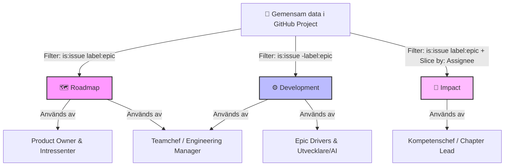

## Steg-för-steg-guide för GitHub-implementation

Följ dessa instruktioner för att konfigurera arbetssättet i ett GitHub-organisationskonto.

### Steg 1: Skapa projektet

1. Navigera till din GitHub-organisation och välj **Projects** -> **New project**.
2. Välj mallen **Board** och klicka på **Create**.
3. Döp om projektet till `[Teamnamn] Delivery Board`.

### Steg 2: Konfigurera statuskolumnerna

Hitta standardfältet `Status` under "Fields" i projektets inställningar och mappa om kolumnerna till följande fyra värden:

* `🔵 Refinement Queue`
* `🟡 Ready for Dev`
* `🟢 Active Development`
* `✅ Done`

### Steg 3: Skapa det anpassade fältet "Horizon"

1. Klicka på plusstecknet bredvid "Fields" och välj **Add field**.
2. Välj "Create a project field".
3. Sätt namnet till `Horizon` och välj typen **Single select**.
4. Lägg till följande tre alternativ med tillhörande färgkodning:
    * `Now` (Grön)
    * `Next` (Gul)
    * `Later` (Blå)

### Steg 4a: Konfigurera vyerna

Detta arbetssätt fungerar genom att filtrera samma underliggande data i tre olika skräddarsydda vyer:

* **A. Roadmap (För Intressentavstämning & Product Owners):**
  * Skapa en ny vy (Board) i projektet och döp den till `Roadmap`.
  * Sätt filter till: `is:issue label:epic` (säkerställ datan genom att tagga moder-issues med 'epic').
  * Välj **Group by**: `Horizon`.
  * *Resultat:* Intressenter ser endast övergripande Epics sorterade efter tidshorisont. GitHub visar automatiskt en procentuell framstegsindikator baserad på underliggande sub-issues.
  * > 💡 **Förtydligande:** Nya Epics som skapas hamnar automatiskt i status `🔵 Refinement Queue` och har ännu inget värde i `Horizon`-fältet. I denna vy kommer de därför att visas i en egen kolumn, ofta kallad "No value". Detta är avsiktligt. Den kolumnen fungerar som en kö för Product Owner att under *Horizon Sync*-mötet dra kort ifrån för att aktivt prioritera dem till `Now`, `Next`, eller `Later`.
* **B. Development (För Utvecklingsteamet):**
  * Skapa en ny vy och döp den till `Development`.
  * Sätt filter till: `is:issue -label:epic`.
  * *Resultat:* Utvecklarna ser, flyttar och uppdaterar sina enskilda tekniska sub-issues i det dagliga arbetet utan att vyn störs av högnivå-Epics.
* **C. Impact (För Kompetens- och Linjechefer):**
  * Skapa en ny vy (förslagsvis i listformat) och döp den till `Impact`.
  * Sätt filter till: `is:issue label:epic has:assignee`.
  * Välj **Group by**: `Assignee` (eller ditt anpassade `Driver`-fält).
  * *Resultat:* Chefer med personal- och löneansvar kan filtrera på en specifik utvecklares namn. Det ger en objektiv historik i realtid över vilka Epics som medarbetaren har förberett, brutit ner och framgångsrikt drivit i mål under året.

### Steg 4b: Sätt WIP-gränser (Work in Progress)

För att konkretisera Little’s lag och skydda teamet från överbelastning ställer vi in hårda begränsningar för hur många Epics/sub-issues som får ligga i de aktiva kolumnerna samtidigt.

1. Håll muspekaren över kolumnrubriken för `🟢 Active Development` och klicka på de tre prickarna (`...`).
2. Välj **Set column limit**.
3. Ange det maximala antalet kort som tillåts (rekommendation: antal utvecklare i teamet minus 1, eller max `2` per utvecklare om ni räknar sub-issues). Klicka på **Save**.
4. Gör samma sak för kolumnen `🟡 Ready for Dev` (den rörliga bufferten) för att förhindra att ni bygger upp en för stor hög med "ready"-stämplat arbete.

> 💡 **Hur GitHub hanterar WIP-gränser:** GitHub blockerar inte tekniskt en flytt om gränsen passeras, men kolumnen blir tydligt rödmarkerad och visar ett varningstecken (t.ex. `6/4`). Detta fungerar som en visuell trigger för Teamchefen att agera under det dagliga arbetet.

#### Visuell översikt: Rollernas primära vyer

Följande diagram visar hur projektets data strömmas till rätt målgrupp utifrån de tre vyerna:



### Steg 5: Automatiskt intag via Issue-mallar (Issue Templates)

För att säkerställa att både Epics och buggar automatiskt hamnar i `🔵 Refinement Queue` med rätt struktur, skapar vi två mallar i ert GitHub-repository:

1. Navigera till ert repository -> **Settings** -> **Features** -> **Issues** -> Klicka på **Set up templates**. Ett bättre alternativ är att lägga mallarna direkt i ert repository under .github/ISSUE_TEMPLATE/$TEMPLATE_NAME.
2. Skapa en mall för **Epic / Feature Request**:
   * **Namn:** `Epic Intake`
   * **Beskrivning:** Används för nya affärsinitiativ och större funktioner.
   * **Innehåll (Markdown):** Klistra in de tre frågorna från Kapitel 5 (Kontext, Affärsvärde, Acceptanskriterier).
   * **Default Label:** Lägg till märkningen `epic`.
3. Skapa en mall för **Bug Report**:
   * **Namn:** `Bug Report`
   * **Beskrivning:** Används för att rapportera fel i systemet.
   * **Innehåll (Markdown):** Skapa fält för: *1. Gick fel (reproduktion)*, *2. Förväntat beteende*, *3. Allvarlighetsgrad (Kritisk/Standard)*.
   * **Default Label:** Lägg till märkningen `bug`.

### Steg 6: GitHub Workflows (Automatiska flödesregler)

För att slippa flytta kort manuellt när nya issues skapas, använder vi GitHub Projects inbyggda arbetsflöden.

1. Gå till ert **Project** och klicka på de tre prickarna uppe till höger -> **Workflows**.
2. Aktivera följande två standardflöden:
   * **Item added to project:** Sätt regel till: *When an item is added to project* $\rightarrow$ *Set value* Status to `🔵 Refinement Queue`.
   * **Item closed:** Sätt regel till: *When an item is closed* $\rightarrow$ *Set Value* Status to `✅ Done`.

### Steg 6b: Automatiserad styrning för Kritiska Buggar och WIP-limits (GitHub Actions)

För att säkerställa att kritiska buggar direkt hamnar i `🟢 Active Development` och att autonoma agenter inte överbelastar systemet, sätter vi upp två GitHub Actions:

#### 1. Kritiska Buggar – Automatisk Escalation

Skapa filen `.github/workflows/critical-bug-auto-move.yml` för att automatiskt flytta kritiska buggar till Active Development:

```yaml
name: "Critical Bug Auto-Move to Active Development"

on:
  issues:
    types: [labeled]

jobs:
  move-critical:
    if: contains(github.event.issue.labels.*.name, 'critical')
    runs-on: ubuntu-latest
    steps:
      - name: Move critical issue to Active Development
        uses: actions/github-script@v7
        with:
          script: |
            const projectNodeId = "YOUR_PROJECT_NODE_ID"; // Hämta från GitHub GraphQL eller Projects UI
            const activeDevStatusId = "ACTIVE_DEV_STATUS_ID"; // Status för 🟢 Active Development
            const nowHorizonId = "NOW_HORIZON_ID"; // Horizon värde för "Now"
            
            // Uppdatera issue i projektet (kräver GitHub GraphQL API)
            // Denna logik kan också göras manuellt via Projects UI med begränsningar
            console.log(`Critical bug #${context.issue.number} flaggad för manuell escalation`);
```

> 💡 **Notering:** GitHub Projects automation för labels är begränsad. För en robust lösning rekommenderas att teamet **manuellt eskalerar** kritiska buggar (`critical` label) till `🟢 Active Development` eller använder en dedikerad externa automation tool.

#### 2. AI Agent WIP Limit Guard

Skapa även filen `.github/workflows/ai-wip-limit.yml` för att skydda WIP-gränser för AI-agenter:

```yaml
name: "AI Agent WIP Limit Guard"

on:
  issues:
    types: [assigned, edited]

jobs:
  check-ai-wip:
    runs-on: ubuntu-latest
    steps:
      - name: Check active issues for AI Agent
        uses: actions/github-script@v7
        with:
          script: |
            const aiAgentName = "namnet-pa-er-ai-agent"; // Ersätt med agentens GitHub-användarnamn
            const maxWip = 2;
            
            // Hämta alla öppna issues tilldelade till agenten
            const issues = await github.rest.issues.listForRepo({
              owner: context.repo.owner,
              repo: context.repo.repo,
              assignee: aiAgentName,
              state: "open"
            });
            
            // Filtrera på de som ligger i projektets aktiva utvecklingsfas
            // (Här kan ni även lägga till logik för att matcha projekt-status om det behövs)
            if (issues.data.length > maxWip) {
              // Posta en varning och ta bort tilldelningen för att skydda flödet
              await github.rest.issues.createComment({
                owner: context.repo.owner,
                repo: context.repo.repo,
                issue_number: context.issue.number,
                body: `⚠️ **WIP Limit Exceeded:** AI-agenten \`@${aiAgentName}\` har redan ${issues.data.length} aktiva uppgifter. Denna sub-issue har tagits bort från agentens kö i väntan på kapacitet.`
              });
              
              await github.rest.issues.removeAssignees({
                owner: context.repo.owner,
                repo: context.repo.repo,
                issue_number: context.issue.number,
                assignees: [aiAgentName]
              });
            }
```

### Steg 6c: Rekommenderad färgkodning för Labels (Etiketter)

Gå till **Issues** -> **Labels** i ert repo och städa upp så att ni har följande färgkodade bas:

* `epic` (Färg: Mörkblå `#0366d6`) – Identifierar moderinitiativ för intressenter.
* `bug` (Färg: Röd `#d73a4a`) – Standardbuggar som ska genom Triage.
* `critical` (Färg: Svart/Mörkröd `#b60205`) – Produktionsstopp som direkt triggar "svärmning" i `🟢 Active Development`.

### Steg 7: Automatisk framstegsindikator (Parent/Child-länkning)

För att chefer och intressenter ska se exakta framsteg i `Roadmap` utan att utvecklarna behöver uppdatera moder-Epicen manuellt, utnyttjar vi GitHubs inbyggda relationer mellan Tasklists och Projects:

1. **När en Epic bryts ner under Refinement:** Öppna Epic-issuen i ert repository och klicka på **Add tasklist** i beskrivningen.
2. **Skapa sub-issues direkt i listan:** Skriv namnet på de tekniska uppgifterna direkt i listan och klicka på ikonen för att konvertera dem till riktiga issues i ert repository. Detta skapar en automatisk koppling där Epicen blir en "Parent" till dina sub-issues.
3. **Aktivera framstegskolumnen i projektet:**
   * Gå till er **Roadmap** (eller den vy ni vill visa framstegen i).
   * Klicka på den lilla nedåt-pilen bredvid vyns namn uppe i fliken, alternativt klicka på plus-ikonen (`+`) längst till höger bland kolumnrubrikerna om ni använder tabellvy.
   * Välj **Fields** i menyn.
   * Bocka i system-fälten **Tracks** (visar antal stängda sub-issues, t.ex. `2/5`) och **Progress** (visar en grafisk och procentuell framstegsbar baserad på tillhörande Tasklists).

> 💡 **Felsökningstips:** Om du inte hittar *Tracks* eller *Progress* i listan över fält, beror det oftast på att projektet är helt tomt. GitHub döljer ibland dessa fält i gränssnittet tills det finns minst en issue i projektet som faktiskt innehåller en aktiv Tasklist. Lägg till din första Epic med en tillhörande tasklist, så dyker fälten upp under vy-inställningarna.

### Steg 8: Konfigurera Insikter (Insights)

För att få en datadriven överblick över teamets flöde och snabbt kunna identifiera flaskhalsar, konfigurera följande tre diagram under projektets **Insights**-flik.

#### 1. Kumulativt flödesdiagram (Cumulative Flow Diagram)

Detta är det viktigaste diagrammet för att övervaka teamets hälsa över tid.

*   **Syfte:** Visualiserar antalet ärenden i varje statuskolumn. Ett växande `Development`-område signalerar att mer arbete påbörjas än vad som slutförs, vilket indikerar en flaskhals.
*   **Konfiguration:**
    *   Skapa en ny insikt och välj **Chart**.
    *   Välj **Cumulative flow diagram**.
    *   **X-axel:** `Time`
    *   **Y-axel:** `Count of items`
    *   **Group by:** `Status`

#### 2. Hastighet (Velocity)

Detta diagram hjälper er att förstå och förutse hur mycket arbete teamet kan slutföra per iteration.

*   **Syfte:** Mäter hur många ärenden som flyttas till `✅ Done` per tidsperiod. Ger en datadriven grund för planering.
*   **Konfiguration:**
    *   Skapa en ny insikt och välj **Chart**.
    *   **Layout:** `Bar chart`
    *   **X-axel:** `Iteration` (eller `Time` grupperat per vecka/månad)
    *   **Y-axel:** `Count of items`
    *   **Filter:** `Status:Done`

#### 3. Cykeltid (Cycle Time)

Detta diagram visar den faktiska tiden det tar för ett ärende att röra sig genom er process.

*   **Syfte:** Mäter tiden från att ett ärende går in i `🟢 Active Development` tills det når `✅ Done`. Hjälper er att se om era förbättringsåtgärder faktiskt kortar ledtiderna.
*   **Konfiguration:**
    *   Skapa en ny insikt och välj **Chart**.
    *   **Layout:** `Line chart`
    *   **X-axel:** `Time`
    *   **Y-axel:** `Cycle time`
    *   **Filter:** `Status:Done`
